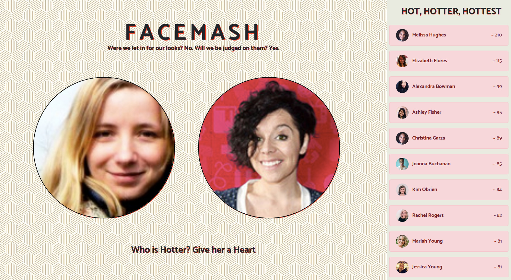

# Facemash

This Website is set up as a type of "hot or not" game

## Screenshot



## Project setup

```
npm install
```

```
npm run watch
```

```
cp .env.example .env
```

setup ENV FILE

```
php artisan key:generate
```

```
php artisan migrate
```

assets will be found [here](https://github.com/sanjaypj/facemash-assets)
